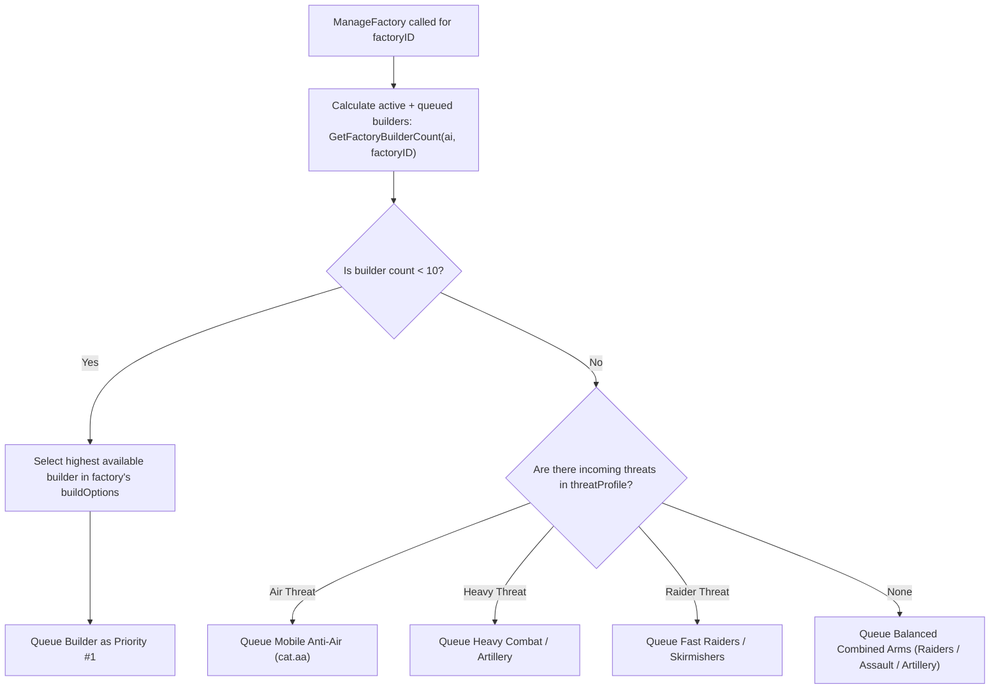

# TechAI: Factory Builder Priority, Threat Counter-Production, Commander Anti-Lingering, & Morph Isolation Walkthrough

## Summary of Changes

We updated the **TechAI** gadget ([ai_techai.lua](file:///d:/TA-master/TA-master/luarules/gadgets/ai_techai.lua)) to implement:
1. **Factory Builder Prioritization & Cap (Max 10 per Factory)**:
   - Factories build builders first if the individual factory has not reached its 10-builder limit.
   - Automatically replenishes builders if any are destroyed.
2. **Counter-Production Against Incoming Enemy Units**:
   - Live threat detection via `gadget:UnitDamaged`, `gadget:UnitEnteredLos`, and 2600-elmo base perimeter scans.
   - Counters incoming air threats with Anti-Air (`cat.aa`), heavy armor with heavy combat / artillery (`cat.t5combat`, `cat.t4combat`, `cat.artillery`, `cat.combat`), and raider swarms with fast raiders / skirmishers (`cat.raiders`, `cat.combat`).
3. **Commander Base Focus & Zero Factory Lingering**:
   - The Commander dynamically builds energy, metal extractors, metal makers, and factories as needed.
   - Completely removes factory-guarding orders from the Commander.
   - Active step-away behavior: if the Commander is within 280 elmos of any factory, it steps away into open base terrain so factory exits remain clear and the Commander stays productive.
4. **Commander Morph Support Isolation**:
   - Builders and nano turrets must **never** assist the Commander's morph (as external support is not permitted).
   - Removed all builder repair loops targeting morphing units, and added `IsMorphingCommander(unitID, ai)` guards to ensure builders and nanotowers strictly ignore morphing commanders.

---

## Detailed Architecture & Mechanics

### 1. Factory Builder Prioritization & 10-Builder Limit per Factory

- **Per-Factory Association**:
  - In `HandleUnitCreated`, each newly built constructor is associated with its source factory: `ai.factoryBuilders[sourceFac][unitID] = true` and `ai.builderSourceFactory[unitID] = sourceFac`.
  - When a constructor dies, `gadget:UnitDestroyed` frees that slot from the source factory.
- **Queue Accounting**:
  - `GetFactoryBuilderCount(ai, factoryID)` counts both living builders in the field and constructors currently queued in `spGetFullBuildQueue(factoryID, 0)`.
  - Guarantees each factory prioritizes building its 10 constructors first before transitioning to military units.
  - If casualties reduce builder count below 10, the factory resumes builder production until the 10-unit quota is restored.

---

### 2. Threat Detection & Counter-Unit Production

- **Threat Telemetry Sources**:
  1. `gadget:UnitDamaged`: When an allied unit or structure is damaged by an enemy attacker, `attackerDefID` is immediately inspected:
     - Aircraft (`udef.canFly`): $+2$ air threat.
     - Heavy / Armored (`metalCost > 450` or `tech >= 3` or `health > 1800`): $+2$ heavy threat.
     - Raider (`speed >= 2.0` or `role == "raider"`): $+2$ raider threat.
     - Artillery (`role == "artillery"` or `maxRange >= 650`): $+2$ artillery threat.
  2. `gadget:UnitEnteredLos`: Enemy mobile units entering LOS within 3,000 elmos of the base update the threat profile.
  3. `UpdateIncomingThreatProfile`: Every 90 frames (~3s), scans a 2,600-elmo cylinder around base. Updates active threat counts and applies smooth decay when threats are neutralized.
- **Factory Counter-Unit Assignment**:
  - Once the 10-builder quota is met, `ManageFactory` matches build options against `cat.aa`, `cat.combat`/`cat.artillery`/`cat.t4combat`/`cat.t5combat`, and `cat.raiders` to produce hard counters to incoming forces.

---

### 3. Commander Base Focus & Anti-Lingering

- **No Factory Guarding**:
  - Removed factory nano-boost guard order from `HandleUnitCreated`.
  - Removed Section 3b Commander factory guard order from `ManageBuilder`.
- **Dynamic Resource-Driven Task Selection**:
  - **Energy**: Builds Wind/Solar/Advanced Solar/Fusion when `einc < minc * 12` or `usableEnergy < estor * 0.40`.
  - **Metal**: Claims nearby safe metal extractors, builds metal makers when metal is low and energy is healthy, and upgrades existing mexes.
  - **Factories**: Builds additional factories (different lab types or duplicate facilities) when economy permits (`minc >= 8 and einc >= 70`) or production needs ramping up.
- **Active Factory Avoidance**:
  - If the Commander is within 280 elmos of any factory, it steps away $220$ elmos away into open base space, leaving the factory apron unobstructed and immediately seeking construction tasks.

---

### 4. Morph Support Prohibition

- **Morph Isolation**:
  - In `ManageMorphing`: Removed builder repair loop on morphing units.
  - In `ManageBuilder` Section 1b: Removed builder repair loop on morphing commanders.
  - In `ManageBuilder` Section 12: Added `not IsMorphingCommander(uid, ai)` check so idle builders and rezzers never attempt to repair or assist morphing commanders.
  - In `HandleUnitCreated`: Nanotowers are assigned to guard nearby factories (`CMD_GUARD`) rather than idling and potentially attempting to assist the Commander.

---

## Verification & Validation Results

### 1. Lua Syntax & Block Balance
- **Tool**: `diagnose_lua.py`
- **Result**: `0 unclosed blocks` — **PERFECT MATCH**.

### 2. Automated Mechanics Verification
- **Test Script**: `test_factory_and_threat_mechanics.py`
- **Result**:
  - `[PASS]` `IsMorphingCommander` helper verified.
  - `[PASS]` Section 12 repair check ignores morphing commanders.
  - `[PASS]` Zero builder assist orders in `ManageMorphing`.
  - `[PASS]` Zero builder assist orders in Commander morph section.
  - `[PASS]` Commander does not guard newly created factories.
  - `[PASS]` Section 3b factory nano-boosting removed.
  - `[PASS]` Commander factory anti-lingering step-away verified.
  - `[PASS]` Factory builder prioritization up to 10 builders per factory active.
  - `[PASS]` `UpdateIncomingThreatProfile` & `gadget:UnitDamaged` active.

### 3. Production & Threat Counter Simulation
- **Test Script**: `test_production_simulation.py`
- **Result**:
  - Cycles 01–10: Factory built 10 builders first.
  - Cycle 11: Produced scout.
  - Cycles 12–13: Successfully countered injected air threats with Anti-Air (`cat.aa`).
  - Cycle 14: Successfully countered injected heavy threat with Heavy Combat unit (`cat.combat`).
  - Cycles 19–21: Rebuilt lost constructors back to the 10-builder limit.

### 4. SHA-256 Parity Verification
- **Workspace File**: `d:\TA-master\TA-master\luarules\gadgets\ai_techai.lua`
- **Distro File**: `C:\Users\Shar\Documents\My Games\Spring\games\taaitest.sdd\luarules\gadgets\ai_techai.lua`
- **Workspace SHA-256**: `a9af1f075ebe2c43565a101919ce01d2186d5043ce0df1d2200b3265d72b5ddf`
- **Distro SHA-256**: `a9af1f075ebe2c43565a101919ce01d2186d5043ce0df1d2200b3265d72b5ddf`
- **Status**: **100% SHA-256 PARITY VERIFIED**.
